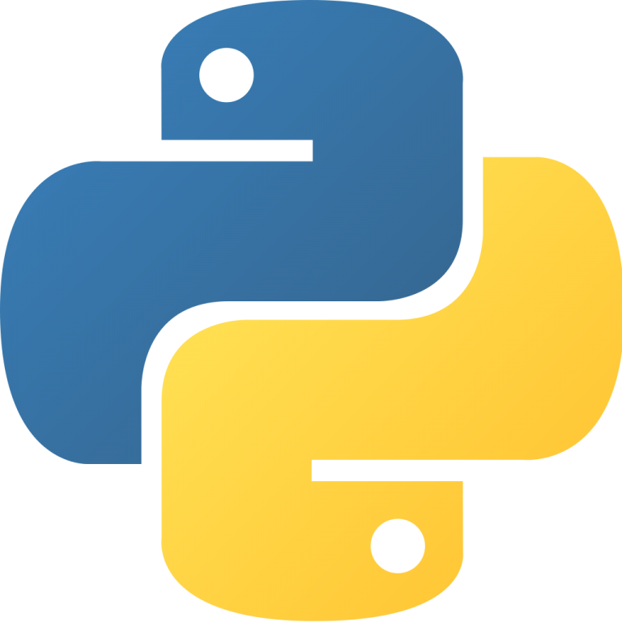
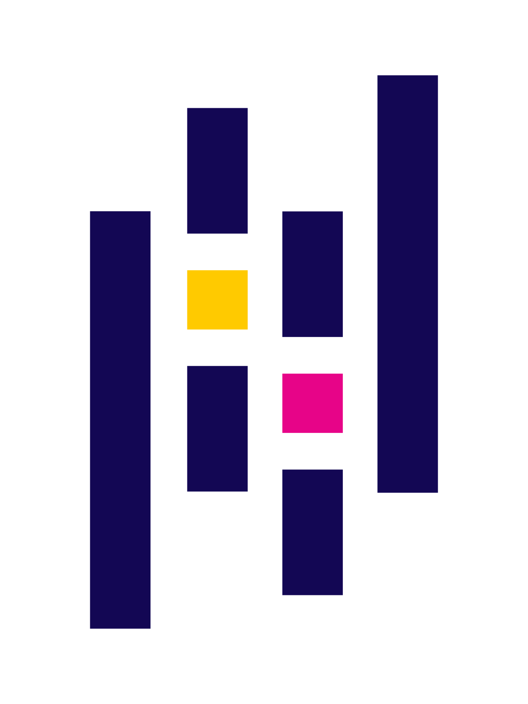
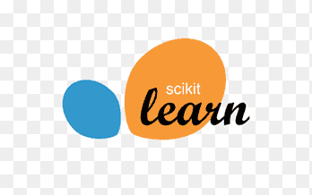
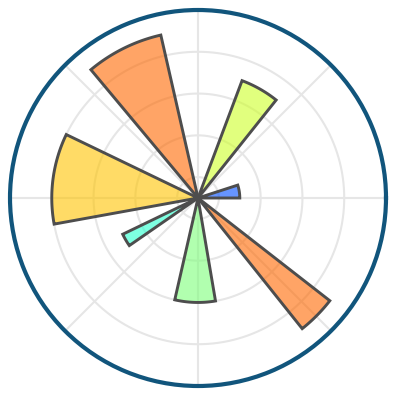
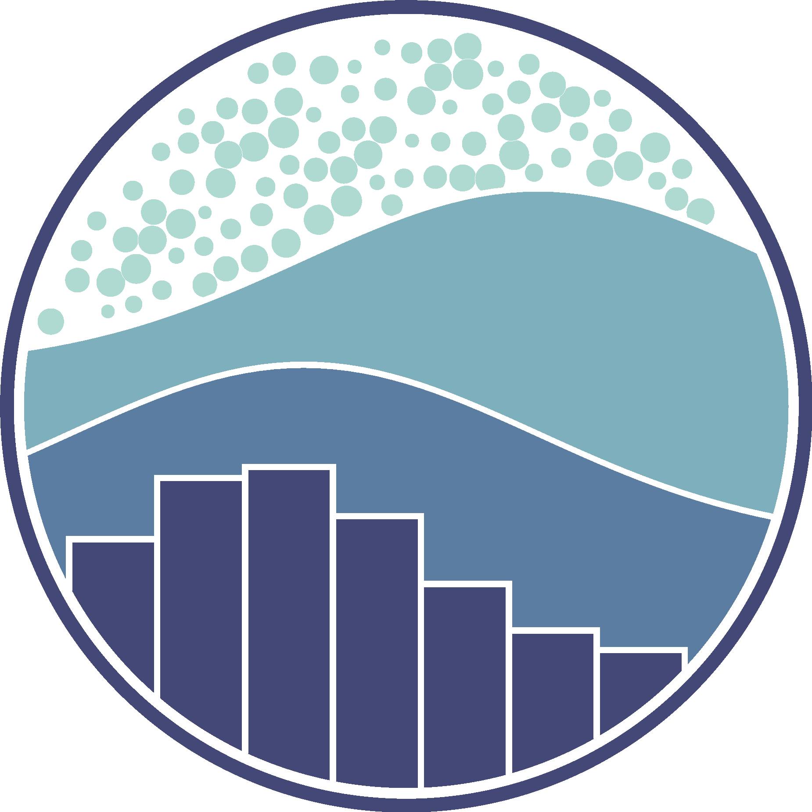

# Hi! I'm Elita 👋
I am an active third-year undergraduate student majoring in **Information Systems** with a growing interest in working with data and learning how it can help people make better decisions.

Currently, I am joining the **Coding Camp 2025 powered by DBS Foundation** on **Machine Learning Engineer** path, where I'm gaining hands-on experience in data analysis, modeling, TensorFlow, and Scikit-Learn.

 I’m now seeking **internship** or **entry-level** opportunities where I can apply my skills, gain hands-on experience, and continue learning in a professional setting.

# Languages and Tools

  
  
  
  
  
  
  

