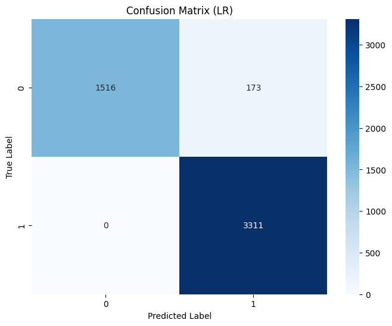
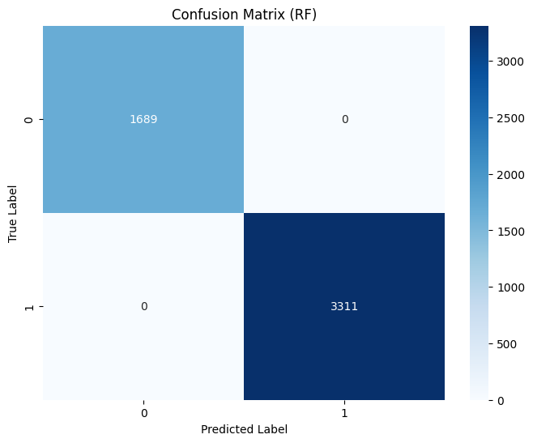

# Project Overview
This project is part of the final submission for the "Belajar Machine Learning untuk Pemula" course. The main objective is to build a machine learning workflow starting with unsupervised learning (clustering) and using the clustering results to create a supervised classification model.

During the clustering phase, the optimal number of clusters is determined using the Silhouette Score, to ensure well-separated and meaningful clusters in the data. After clustering, a comprehensive cluster interpretation is performed by reversing the preprocessing steps to restore the original feature values. Aggregation techniques were applied to describe the characteristics of each cluster-using mean, min, and max for numerical features and mode for categorical features. This analysis identified key patterns and distinguishing attributes for each cluster.

The dataset, which has now been annotated with cluster-based labels, is used as the basis for the classification stage. These labels serve as target classes for training the classification model. The performance of the model is evaluated using standard metrics, including accuracy and F1-score, measured on the training and testing sets to validate its generalization capabilities.

This project showcases a complete end-to-end machine learning workflow, highlighting the value of thoughtful data interpretation, effective labeling, and model evaluation in producing reliable and interpretable machine learning solutions.

**Project Details:** [Github](https://github.com/camelliatea/dicoding-proyek-machine-learning/)

### Languages and Libraries
- **Programming Language**: Python
- **Data Manipulation**: Pandas, NumPy
- **Data Visualization**: Matplotlib, Seaborn
- **Machine Learning**: Scikit-Learn (KMeans, silhouette_score, PCA, train_test_split, LogisticRegression, RandomForestClassifier)
- **Data Preprocessing**: OneHotEncoder, LabelEncoder, MinMaxScaler, StandardScaler
- **Model Evaluation**: confusion_matrix

### Dataset
This project uses the [Beverage Sales Dataset](https://www.kaggle.com/datasets/sebastianwillmann/beverage-sales) from Kaggle. The dataset includes a mix of Business-to-Business (B2B) and Business-to-Consumer (B2C) transactions, designed to simulate realistic sales patterns within the beverage industry.

# Interpretation Cluster
```
Analisis Karakteristik Setiap Cluster:

Cluster 1:
 - Unit_Price: min = 0.33, max = 6.43, mean = 2.44
 - Quantity: min = 1.00, max = 65.00, mean = 44.46
 - Discount: min = 0.05, max = 0.12, mean = 0.08
 - Total_Price: min = 0.39, max = 163.77, mean = 87.56
 - Customer_Type: mode = B2B
 - Category: mode = Alcoholic Beverages

Cluster 2:
 - Unit_Price: min = 0.46, max = 6.43, mean = 2.40
 - Quantity: min = 1.00, max = 15.00, mean = 8.01
 - Discount: min = 0.00, max = 0.00, mean = 0.00
 - Total_Price: min = 0.46, max = 163.77, mean = 27.52
 - Customer_Type: mode = B2C
 - Category: mode = Soft Drinks
```
**Cluster 1**: 
- The average unit price of 2.44, within a range of 0.33 to 6.43, indicates that the products sold generally fall into the low-to-mid price range. 
- The average quantity of 44.46, ranging from 1 to 65, reflects bulk purchasing behavior. 
- The discount variable has a modest average of 0.08, with a range from 0.05 to 0.12, suggesting that the discounts applied are relatively small. 
- The total price per transaction averages 87.56, with a range of 0.39 to 163.77, indicating fairly high-value purchases. 
- The most common customer type in this cluster is B2B, and the most frequent product category is Alcoholic Beverages. These patterns suggest that Cluster 1 is dominated by business customers making high-quantity purchases of alcoholic beverages at moderate prices, with minimal discounts applied.

**Cluster 2**: 
- The unit price averages 2.40, with values ranging from 0.46 to 6.43, indicating that the items sold are also in the low-to-mid price range.
- The average quantity of 8.01, within a range of 1 to 15, suggests small-scale purchases.
- The discount variable remains at 0.00 for both range and average, implying that no discounts were applied to transactions in this cluster.
- The total purchase amount averages 27.52, ranging from 0.46 to 163.77, which reflects relatively low transaction values. 
- The dominant customer type is B2C, and the most frequent product category is Soft Drinks. This indicates that Cluster 2 consists mainly of individual consumers purchasing small quantities of soft drinks without discounts, resulting in low overall spending per transaction.

# Classification Evaluation

### Model Performance Metrics

| Model  | Accuracy | Precision | Recall | F1-Score |
|--------|---------|----------|--------|----------|
| LR     | 0.9654  | 0.9503   | 1.000  | 0.9745   |
| RF     | 1.0000  | 1.0000   | 1.000  | 1.0000   |

**Logistic Regression**



> The Logistic Regression model demonstrated strong performance, achieving a recall of 100%, indicating that it correctly identified all positive cases. However, its precision was slightly lower at 95.03%, suggesting the presence of some false positives, cases where negative instances were incorrectly classified as positive. According to the confusion matrix, the model produced 3,311 True Positives (TP), 1,689 True Negatives (TN), 173 False Positives (FP), and 0 False Negatives (FN).

**Random Forest**




> The Random Forest model showed perfect performance in all evaluation metrics, with 100% values for accuracy, precision, recall, and F1-score. The confusion matrix showed 3,311 TP, 1,689 TN, and 0 FP or FN, indicating perfect classification. While these results indicate a highly effective model, it also raises concerns of overfitting, where the model may have learned the training data very well, potentially reducing its ability to generalize to new data that it has not seen before.

### Tuning Hyperparameter

The `RandomizedSearchCV` method was employed to optimize hyperparameters for both the Logistic Regression and Random Forest models. For **Logistic Regression**, the best parameters identified were {'solver': 'liblinear', 'penalty': 'l2', 'C': 1438.45}. These settings led to a perfect classification result, with the model achieving an accuracy of 1.00 after tuning.

For the **Random Forest** model, the tuning process involved 75 fits across 15 different hyperparameter combinations using 5-fold cross-validation. The optimal configuration found was {'n_estimators': 300, 'min_samples_split': 10, 'min_samples_leaf': 2, 'max_features': 'log2', 'max_depth': 30, 'bootstrap': True}. Similar to Logistic Regression, this tuned model also achieved an accuracy of 1.00, indicating excellent predictive performance. However, such perfect accuracy warrants further validation to ensure the model is not overfitting.

### Limitations
The classification dataset shows an **unbalanced label distribution**, where one class significantly outnumbers the others. This imbalance can lead the model to become biased toward predicting the majority class, resulting in suboptimal performance on the minority class. This skewed distribution may affect the model’s ability to generalize well and accurately classify instances from underrepresented classes.